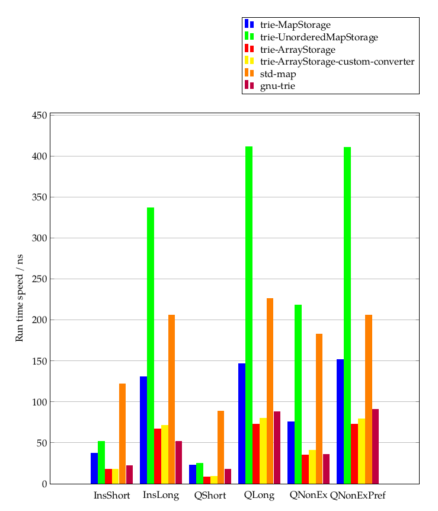

# tries

Tries in C++

## Directory structure

* benchmark contains benchmark results.
* catch2 contains the library used for testing
* res contains benchmark data
* trie.hpp is the main header file
* test.cpp and testcases.cpp contain test cases
* benchmark-trie.cpp contains benchmark cases

## Usage & Requirements

This work is licensed under GNU-GPL 2.0; see [LICENSE.txt](LICENSE.txt) for more information.

### Usage only

Since this is a header-only library, it is enough to include trie.hpp into the file you want to use tries in!
A C++20 compliant compiler is needed. 
I confirmed that gcc 10.0.1 and 10.1.0 work; Clang doesn't seem to work (at least in version 10.0.0).

### Tests

In order to execute tests, the dependency catch2 must be available under catch2/catch.hpp.
The tests can be executed with `make unittests`.

### Benchmarks

In order to execute benchmarks, the dependency catch2 must be available under catch2/catch.hpp.
Further it is necessary that gcc is used because we compare the library at hand with GNU's trie implementation.
The performance-benchmarks can be executed with `make benchmark`.
The memory-benchmarks can be executed with `make benchmark_memory`.
The results can be found in benchmark/ (I tested on an Intel Core i7 from 2012).
Here are my results for the performance benchmarks:

This library is listed in four different configurations and compared to `std::map` and `__gnu_pbds::trie` [A GNU trie implementation](https://gcc.gnu.org/onlinedocs/libstdc++/ext/pb_ds/trie_based_containers.html).

